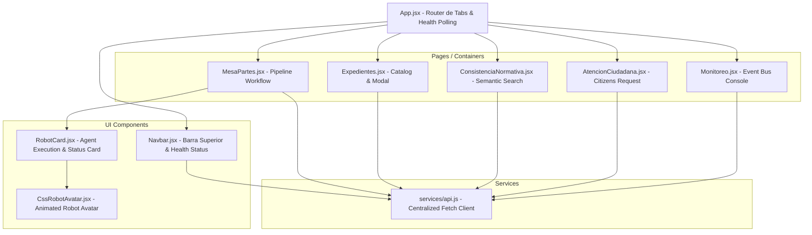

# 🛠️ Plan de Implementación — Frontend (SMA Congreso)

> **Pregunta clave que responde este documento:** *¿Cómo se implementará y cuál es la arquitectura técnica detallada del Frontend?*

---

## 🏗️ 1. Arquitectura de Componentes del Frontend

La aplicación utiliza un patrón de **componentes contenedores (Pages)** y **componentes de presentación (UI Components)** con un cliente HTTP centralizado.



---

## 🔌 2. Capa de Servicios y API HTTP ([`services/api.js`](file:///c:/Users/julio/Downloads/Proyectos_2026/v2_proy/v2_proyintegrado/frontend/src/services/api.js))

El módulo `api.js` actúa como el único punto de contacto con la API REST del backend FastAPI.

### Implementación del cliente `request`:

```javascript
const API_BASE_URL = 'http://127.0.0.1:8085/api';

async function request(endpoint, options = {}) {
  const url = `${API_BASE_URL}${endpoint}`;
  try {
    const response = await fetch(url, options);
    if (!response.ok) {
      let errorDetail = `Error ${response.status}: ${response.statusText}`;
      try {
        const errorJson = await response.json();
        errorDetail = errorJson.detail || errorDetail;
      } catch (e) {}
      throw new Error(errorDetail);
    }
    return await response.json();
  } catch (err) {
    console.error(`[API Error] ${endpoint}:`, err);
    throw err;
  }
}
```

### Funciones Principales Exportadas:
1. `getHealth()`: Polling de salud general (PostgreSQL, MongoDB, NVIDIA NIM).
2. `uploadDocument(file)`: Envío en `FormData` para extracción de texto.
3. `runPhase1(data)`: Ejecución del Agente Distribuidor (Nivel 1).
4. `runAgentComision(data)`: Asignación temática de comisión y parlamentarios.
5. `runAgentConstitucional(data)`: Auditoría respecto a la CPE 2009.
6. `runAgentConsistencia(data)`: Cotejo vectorial contra leyes vigentes.
7. `emitPdf(data)`: Generación de informe institucional en PDF.
8. `runAgentNotificador(data)`: Despacho de correo HTML formal.
9. `getExpedientes(limit)` & `getExpedienteDetalle(id)`: Consultas de expedientes y bitácora.
10. `searchNormativa(query)`: Búsqueda vectorial semántica pgvector.

---

## 🎨 3. Sistema de Estilos y Componentes Visuales

### 3.1. Design Tokens en [`index.css`](file:///c:/Users/julio/Downloads/Proyectos_2026/v2_proy/v2_proyintegrado/frontend/src/index.css)
- **Variables Globales**:
  - `--bg-dark`: `#0f172a`
  - `--card-bg`: `#1e293b`
  - `--accent-gold`: `#f59e0b`
  - `--accent-green`: `#10b981`
  - `--accent-blue`: `#3b82f6`
  - `--accent-red`: `#ef4444`

### 3.2. Tarjeta de Agente Robot ([`RobotCard.jsx`](file:///c:/Users/julio/Downloads/Proyectos_2026/v2_proy/v2_proyintegrado/frontend/src/components/RobotCard.jsx))
Componente altamente dinámico que acepta los siguientes `props`:
- `name`: Nombre formal del agente (ej. `Agente_Distribuidor`).
- `role`: Rol institucional (ej. `Clasificador Nivel 1`).
- `level`: Nivel en la jerarquía (ej. `Nivel 1`, `Nivel 2`).
- `isActive`: Boolean que activa el borde resplandeciente, animación de rotación y halo resplandeciente.
- `isCompleted`: Boolean que marca la finalización exitosa con un badge verde `✓ Ejecutado`.
- `desc`: Descripción de las atribuciones del agente.
- `justificacion`: Explicación o razonamiento devuelto por el modelo LLM.
- `model`: Nombre del LLM en ejecución (ej. `nvidia/llama-3.1-nemotron-70b-instruct`).
- `theme`: Esquema de color (`cyan`, `blue`, `green`, `gold`, `pink`, `violet`).

---

## 🔄 4. Flujo de Trabajo Detallado de la Mesa de Partes (`MesaPartes.jsx`)

La vista maneja una máquina de estados implícita mediante variables React:

```
[ Estado Inicial: Sin documento ]
               │
               ▼  (Subir archivo / Texto directo)
[ Estado 1: Documento cargado + Texto extraído ]
               │
               ▼  (Clic: Ejecutar Fase 1)
[ Estado 2: Agente Distribuidor Ejecutando ]
               │
               ▼  (Respuesta recibida)
[ Estado 3: PUNTO DE CONTROL HUMANO (Pausado) ]
    ├── Operador valida / cambia categoría
    └── Clic: "Confirmar y Continuar a Fase 2"
               │
               ▼
[ Estado 4: Ejecución de Agentes de Auditoría (Fase 2) ]
    ├── Agente Comisión (Asigna directiva parlamentaria)
    ├── Agente Constitucional (CPE 2009 A favor/En contra)
    └── Agente Consistencia (pgvector RAG multihilo)
               │
               ▼
[ Estado 5: Emisión de Dictamen & Notificación ]
    ├── Generación de PDF institucional
    └── Envío de Correo HTML a Miembros de Comisión
```

---

## 🛠️ 5. Plan de Ejecución de Tareas de Desarrollo

1. **Fase 1: Infraestructura y Estilos Base** *(Completado)*:
   - Configuración de Vite + React 19.
   - Creación de `index.css` con variables de diseño, glassmorphism y fuentes Google Fonts.
   - Implementación de [`services/api.js`](file:///c:/Users/julio/Downloads/Proyectos_2026/v2_proy/v2_proyintegrado/frontend/src/services/api.js) con manejo de errores.
2. **Fase 2: Componentes Core de IA** *(Completado)*:
   - Creación de [`CssRobotAvatar.jsx`](file:///c:/Users/julio/Downloads/Proyectos_2026/v2_proy/v2_proyintegrado/frontend/src/components/CssRobotAvatar.jsx) para la representación visual interactiva.
   - Construcción de [`RobotCard.jsx`](file:///c:/Users/julio/Downloads/Proyectos_2026/v2_proy/v2_proyintegrado/frontend/src/components/RobotCard.jsx) para visualizar roles, modelos LLM y justificaciones.
3. **Fase 3: Módulos de Pantalla Principal** *(Completado)*:
   - Desarrollo de [`MesaPartes.jsx`](file:///c:/Users/julio/Downloads/Proyectos_2026/v2_proy/v2_proyintegrado/frontend/src/pages/MesaPartes.jsx) con flujo en 2 fases y pausa humana.
   - Desarrollo de [`Expedientes.jsx`](file:///c:/Users/julio/Downloads/Proyectos_2026/v2_proy/v2_proyintegrado/frontend/src/pages/Expedientes.jsx) con modal de trazabilidad de auditorías.
   - Desarrollo de [`ConsistenciaNormativa.jsx`](file:///c:/Users/julio/Downloads/Proyectos_2026/v2_proy/v2_proyintegrado/frontend/src/pages/ConsistenciaNormativa.jsx) con búsqueda vectorial.
   - Desarrollo de [`AtencionCiudadana.jsx`](file:///c:/Users/julio/Downloads/Proyectos_2026/v2_proy/v2_proyintegrado/frontend/src/pages/AtencionCiudadana.jsx) y [`Monitoreo.jsx`](file:///c:/Users/julio/Downloads/Proyectos_2026/v2_proy/v2_proyintegrado/frontend/src/pages/Monitoreo.jsx).
4. **Fase 4: Pruebas de Integración y Optimización** *(En Proceso)*:
   - Verificación de renderizado en navegadores Chrome/Edge/Firefox.
   - Auditoría de linting con `oxlint`.
